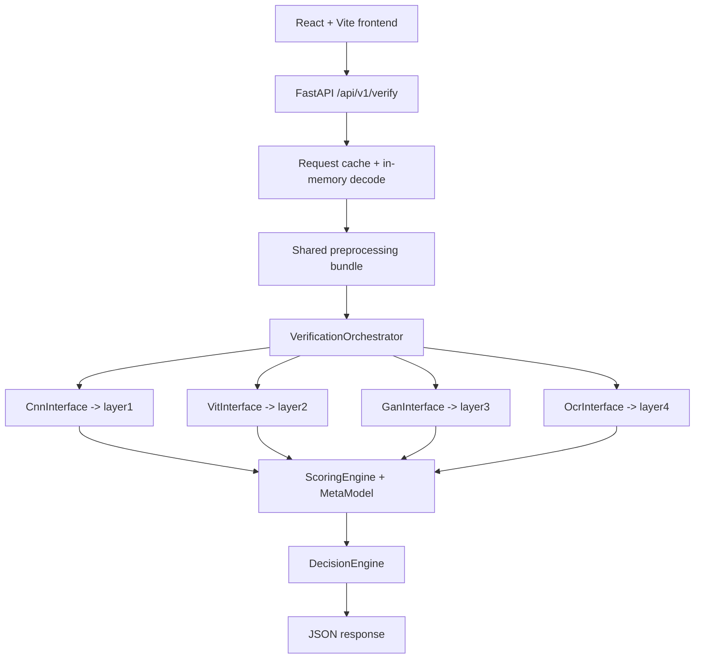

# VeriSight Project Report

Generated from a deep scan of the current workspace on 2026-04-03.

This report covers the repository as it exists now: architecture, runtime flow, directory structure, source file responsibilities, generated artifacts, datasets, tests, and the main launcher scripts. Source files are linked relative to the repo root. Data, weights, logs, and sample images are summarized as artifacts rather than analyzed one-by-one.

## 1. Project Snapshot

VeriSight is a multi-layer image authenticity verification system for refund-fraud and complaint-image analysis. The current implementation is centered on an async FastAPI orchestration layer with in-memory request handling, shared preprocessing, request caching, meta-model fusion, and optional early exit. Four independent scorers sit behind it:

- Layer 1: CNN forensics with RGB + ELA fusion
- Layer 2: ViT-based AI-generated image detection
- Layer 3: GAN artifact detection and CLIP-based fingerprinting
- Layer 4: OCR and expiry-date plausibility analysis

The current runtime path is:

- frontend upload form in `frontend/src/App.jsx`
- FastAPI verify endpoint in `engine/pipeline/api_router.py`
- request-level cache and in-memory decode in `engine/pipeline/api_router.py`
- shared preprocessing in `engine/preprocessing/shared_pipeline.py`
- central async inference orchestrator in `engine/pipeline/orchestrator.py`
- meta-model backed fusion in `engine/scoring_engine.py` and `engine/meta_model.py`
- decision mapping in `engine/decision_engine.py`

The codebase also includes per-layer training/inference tooling, benchmark scripts, a React/Vite frontend, and extensive dataset/model artifacts.

## 2. Architecture

At runtime, the architecture is intentionally centralized: the layers do not fuse scores themselves and do not call one another. They only return their own outputs. The orchestrator owns the final response, but the router now performs in-memory decode and cache lookup before orchestration begins.



The real code is more conservative than the design documents in `Documentation/`: there is no Celery queue, JWT middleware, PostgreSQL audit layer, or SHAP service in the current workspace. The implementation is local and file-backed in the standalone layer services, but the main engine path is now async, in-memory, and cache-aware.

### Core responsibilities

- `engine/pipeline/app.py` creates the FastAPI app and preloads models at startup.
- `engine/pipeline/api_router.py` accepts uploads, hashes bytes for request caching, decodes images in memory, enforces MIME and timeout limits, and returns the canonical JSON payload.
- `engine/pipeline/orchestrator.py` loads the four layer interfaces, prepares the shared bundle once, runs the layers in parallel with per-layer timeouts, applies early-exit gating, and returns telemetry.
- `engine/scoring_engine.py` combines layer scores using meta-model fusion when available and falls back to calibrated weighted averaging when needed.
- `engine/meta_model.py` provides the JSON-backed stacking model used by the scoring engine.
- `engine/decision_engine.py` maps the final score to a platform action.

## 3. End-to-End Execution Flow

### 3.1 Verification request flow

1. The user uploads an image in `frontend/src/App.jsx`.
2. The UI sends the file as `multipart/form-data` to `/api/v1/verify`.
3. The FastAPI router in `engine/pipeline/api_router.py` validates MIME type, reads the upload into bytes, hashes the bytes plus metadata for cache lookup, and decodes the image in memory with `PIL.Image`.
4. If the request is a cache hit, the router returns the cached response immediately. If another request is already computing the same key, the in-flight future is awaited instead of recomputing.
5. `get_orchestrator()` returns a singleton `VerificationOrchestrator` instance.
6. The router hands the decoded image object to the orchestrator. The orchestrator builds the shared preprocessing bundle once and fans out layer work with `asyncio.gather()` plus `run_in_executor()` for CPU-bound code.
7. The CNN layer runs first logically and can trigger early exit when it is both highly confident and sufficiently reliable. In that case the other layers are skipped and marked as degraded/skipped in the response.
8. If early exit does not trigger, the orchestrator runs CNN, ViT, GAN, and OCR in parallel, then computes reliability from uncertainty, fallback flags, and availability state.
9. `ScoringEngine.fuse()` uses the JSON-backed meta-model when available and falls back to calibrated weighted averaging when needed.
10. `DecisionEngine.classify()` maps the score to `AUTO_APPROVE`, `FAST_TRACK`, `SUSPICIOUS`, or `REJECT`.
11. The router returns a response containing `authenticity_score`, `decision`, `layer_scores`, `layer_reliabilities`, `effective_weights`, `confidence`, `layer_status`, `available_layers`, `abstained`, `fusion_strategy`, `meta_model_used`, `early_exit_triggered`, `layer_outputs`, and `processing_time_ms`.
12. The frontend renders the score, decision, confidence band, layer breakdown, and degraded/skipped-layer warnings.

### 3.2 Layer training and inference flows

- Layer 1 trains and evaluates a 6-channel EfficientNet-B4 model with ELA preprocessing, then exports ONNX and Grad-CAM artifacts.
- Layer 2 prepares a processed real/fake split dataset, fine-tunes a HuggingFace ViT model, then exports a Torch checkpoint and ONNX graph.
- Layer 3 builds a real/gan_fake dataset from public or synthetic sources, trains a CLIP-RN50 head, calibrates a real-image centroid, and saves checkpoint/metric files.
- Layer 4 prepares YOLO training data from manifests or CASIA/MICC fallback layouts, fine-tunes a detector, and feeds the resulting weights into OCR verification.
- The evaluation scripts in `evaluation/` run the orchestrator on dataset splits and emit benchmark, latency, history, and threshold-calibration JSON.

### 3.3 Request-time control flow details

The runtime path includes several guardrails:

- per-layer timeouts from `configs/weights.py`
- a request semaphore from `VERISIGHT_MAX_CONCURRENT_REQUESTS`
- a request timeout from `VERISIGHT_REQUEST_TIMEOUT_MS`
- request-level cache keys derived from SHA-256 of the file bytes plus metadata
- MIME-type filtering for JPEG/PNG/WEBP/BMP uploads
- graceful degradation when a model is missing or fails
- early exit when CNN confidence and reliability are both high
- in-memory preprocessing and no temp-file usage in the engine request path

## 4. Directory Structure

```text
VERISIGHT_V1/
  README.md
  REPORT.md
  requirements.lock.txt
  .gitignore
  .github/
    workflows/performance-regression.yml
  Documentation/
    strategic design docs, roadmap notes, PDFs
  configs/
    shared scoring and threshold constants
  engine/
    pipeline, preprocessing, interface adapters, scoring, decisioning, and data utilities
  layer1/
    CNN forensics training, inference, preprocessing, evaluation
  layer2/
    ViT training, ONNX inference, API, dataset preparation
  layer3/
    GAN artifact detection, dataset synthesis, training, smoke tests
  layer4/
    OCR verification, YOLO fine-tuning, API, runner scripts
  evaluation/
    benchmark, latency, regression, calibration, metrics
  frontend/
    React + Vite UI
  tests/
    orchestrator and scoring contract tests
  Data/
    raw and processed datasets
  checkpoints/
    Layer 3 training checkpoints and centroid
  artifacts/
    root artifact staging area (currently empty)
  TEST_IMAGE/
    sample JPEG inputs
  tools/
    currently empty
```

## 5. Source File Map

### 5.1 Root and shared configuration

- [README.md](README.md) is the canonical Windows quick-start guide. It explains how to run the FastAPI backend, the Vite frontend, benchmark scripts, regression checks, and the optional runtime environment variables.
- [requirements.lock.txt](requirements.lock.txt) is the minimal pinned runtime set for the shared orchestration/evaluation path. It locks FastAPI, Uvicorn, ONNX Runtime, NumPy, Pillow, python-multipart, and OpenCV-headless.
- [.github/workflows/performance-regression.yml](.github/workflows/performance-regression.yml) runs a GitHub Actions regression check on pull requests and workflow dispatch. It installs the locked dependencies and runs `evaluation/check_regression.py` when benchmark history exists.
- [.gitignore](.gitignore) contains repository ignore rules.

### 5.2 configs

- [configs/weights.py](configs/weights.py) holds the central runtime constants: model weights, layer timeouts, the reliability floor, calibrated weights, decision thresholds, schema version, benchmark budgets, and the verify endpoint path.
- [configs/__init__.py](configs/__init__.py) is a package export for the shared constants.

### 5.3 engine

#### Orchestration and decisioning

- [engine/pipeline/app.py](engine/pipeline/app.py) defines the FastAPI app, mounts the router, and preloads models on startup.
- [engine/pipeline/api_router.py](engine/pipeline/api_router.py) is the main HTTP endpoint implementation. It validates MIME types, reads the upload into memory, hashes the bytes plus metadata for cache lookup, decodes the image in memory, applies concurrency and timeout controls, and returns the canonical verify response.
- [engine/pipeline/orchestrator.py](engine/pipeline/orchestrator.py) is the core runtime coordinator. It instantiates all four interfaces, prepares the shared preprocessing bundle once, fans out layer work with async execution, applies early-exit gating, validates layer outputs, computes reliability, and records telemetry.
- [engine/scoring_engine.py](engine/scoring_engine.py) combines layer scores with the JSON-backed meta-model when available and falls back to calibrated weighted averaging when needed.
- [engine/decision_engine.py](engine/decision_engine.py) maps the final authenticity score to a decision label using calibrated thresholds.

#### Layer interfaces

- [engine/interfaces/common.py](engine/interfaces/common.py) provides shared helpers: temporary `sys.path` injection, module loading from file path, and fraud-probability to authenticity-score conversion.
- [engine/interfaces/cnn_interface.py](engine/interfaces/cnn_interface.py) wraps Layer 1. It prefers the PyTorch checkpoint path, can consume the shared preprocessed bundle or run its own preprocessing when needed, falls back to ONNX Runtime when needed, and returns a normalized score/raw payload.
- [engine/interfaces/vit_interface.py](engine/interfaces/vit_interface.py) wraps Layer 2. It consumes the shared bundle's `clip_input`, loads the ONNX model, and returns the authenticity score plus `REAL` / `AI_GENERATED` label metadata.
- [engine/interfaces/gan_interface.py](engine/interfaces/gan_interface.py) wraps Layer 3. It can load a trained detector if available, consume the shared bundle inputs, import a module dynamically, or fall back to an unavailable response with a neutral score.
- [engine/interfaces/ocr_interface.py](engine/interfaces/ocr_interface.py) wraps Layer 4. It resolves the best available YOLO weight file, consumes the shared bundle inputs when available, loads `OCRVerificationModule`, and falls back to a neutral detector if no trained OCR model is present.
- [engine/interfaces/__init__.py](engine/interfaces/__init__.py) re-exports the four interfaces.

#### Shared preprocessing and fusion

- [engine/preprocessing/shared_pipeline.py](engine/preprocessing/shared_pipeline.py) builds the shared preprocessing bundle once per request and returns RGB, ELA, normalized tensors/arrays, CLIP input, BGR, and OCR input views.
- [engine/preprocessing/__init__.py](engine/preprocessing/__init__.py) exports `preprocess_all`.
- [engine/meta_model.py](engine/meta_model.py) loads the JSON-backed coefficients, applies sigmoid fusion, and exposes the stacking model used by scoring.
- [engine/meta_model.json](engine/meta_model.json) stores the default coefficients and intercept for meta-model fusion.

#### Shared dataset utilities

- [engine/data/manifest_utils.py](engine/data/manifest_utils.py) discovers labeled images from manifests or folder naming. It infers labels, dataset names, group IDs, and splits, then provides `discover_labeled_images()` and `split_labeled_images()`.
- [engine/data/split_hygiene.py](engine/data/split_hygiene.py) hashes split images and reports cross-split duplicates so training and evaluation splits can be checked for leakage.
- [engine/data/hard_negative_mining.py](engine/data/hard_negative_mining.py) extracts borderline or false-positive samples from benchmark JSON to build a hard-negative set.
- [engine/data/__init__.py](engine/data/__init__.py) re-exports the dataset helpers.
- [engine/__init__.py](engine/__init__.py) re-exports the central engine classes.
- [engine/pipeline/__init__.py](engine/pipeline/__init__.py) re-exports the orchestrator.

### 5.4 layer1

Layer 1 is the CNN forensic module. It uses ELA plus RGB fusion and a modified EfficientNet-B4 backbone.

- [layer1/README.md](layer1/README.md) documents the ELA-based CNN pipeline, the 6-channel fusion design, training/evaluation commands, and ONNX export.
- [layer1/requirements.txt](layer1/requirements.txt) pins the layer-specific training stack: PyTorch, torchvision, NumPy, Pillow, scikit-learn, tqdm, matplotlib, OpenCV, ONNX, and ONNX Script.
- [layer1/run_project.cmd](layer1/run_project.cmd) is the Windows all-in-one runner. It auto-detects CUDA, installs dependencies, trains, evaluates, exports ONNX, and runs inference plus Grad-CAM generation.
- [layer1/configs/train_config.yaml](layer1/configs/train_config.yaml) stores the default training parameters for dataset root, epochs, batch size, image size, worker count, learning rate, weight decay, patience, seed, and output directory.
- [layer1/inference.py](layer1/inference.py) loads a checkpoint, uses the shared preprocessing path in orchestrated runs or its own RGB + ELA preprocessing in standalone mode, runs EfficientNetForensics, and prints the CNN score, forgery probability, and prediction label as JSON.
- [layer1/models/efficientnet_forensics.py](layer1/models/efficientnet_forensics.py) defines the six-channel EfficientNet-B4 model and adapts the first convolution so the pretrained stem can ingest RGB + ELA fusion.
- [layer1/preprocessing/ela.py](layer1/preprocessing/ela.py) generates ELA maps by re-saving the image as JPEG, taking the absolute pixel difference, and scaling the result.
- [layer1/data/dataset.py](layer1/data/dataset.py) discovers labeled images, applies geometric/photo augmentations during training, creates 6-channel tensors, and returns train/val/test loaders with optional balanced sampling.
- [layer1/training/train.py](layer1/training/train.py) is the main training loop. It uses class-balanced sampling, class-weighted loss, AMP, gradient clipping, early stopping, checkpoint saving, and test-set evaluation.
- [layer1/training/__main__.py](layer1/training/__main__.py) simply delegates to `training.train.main()`.
- [layer1/evaluation/metrics.py](layer1/evaluation/metrics.py) computes accuracy, precision, recall, F1, and confusion matrix.
- [layer1/evaluation/evaluate.py](layer1/evaluation/evaluate.py) loads the test split, runs the model on the checkpoint, and prints metrics as JSON.
- [layer1/evaluation/gradcam.py](layer1/evaluation/gradcam.py) builds Grad-CAM maps from the EfficientNet backbone and overlays them on RGB images.
- [layer1/scripts/export_onnx.py](layer1/scripts/export_onnx.py) exports the trained model to ONNX with optional dynamic batch axes.
- [layer1/scripts/gradcam_demo.py](layer1/scripts/gradcam_demo.py) loads a checkpoint, generates a Grad-CAM overlay, and writes the output image.
- [layer1/utils/checkpointing.py](layer1/utils/checkpointing.py) saves and loads checkpoint dictionaries.
- [layer1/utils/device.py](layer1/utils/device.py) resolves the runtime device with CUDA fallback behavior.
- [layer1/utils/reproducibility.py](layer1/utils/reproducibility.py) seeds Python, NumPy, and Torch for deterministic runs.
- [layer1/utils/warnings_control.py](layer1/utils/warnings_control.py) suppresses common non-actionable warnings during training and inference.
- Package markers only: [layer1/data/__init__.py](layer1/data/__init__.py), [layer1/evaluation/__init__.py](layer1/evaluation/__init__.py), [layer1/models/__init__.py](layer1/models/__init__.py), [layer1/preprocessing/__init__.py](layer1/preprocessing/__init__.py), [layer1/scripts/__init__.py](layer1/scripts/__init__.py), [layer1/training/__init__.py](layer1/training/__init__.py), [layer1/utils/__init__.py](layer1/utils/__init__.py).

### 5.5 layer2

Layer 2 is the ViT-based AI-generated image detector.

- [layer2/README.md](layer2/README.md) explains the dataset layouts it accepts, the label mapping, the training/export flow, the API endpoint, and the Docker workflow.
- [layer2/requirements.txt](layer2/requirements.txt) pins FastAPI, Uvicorn, Torch, torchvision, Transformers, ONNX, ONNX Runtime GPU, Pillow, NumPy, and tqdm.
- [layer2/Dockerfile](layer2/Dockerfile) builds a standalone API container from the layer directory.
- [layer2/run_layer2.cmd](layer2/run_layer2.cmd) is the Windows launcher that can prepare the dataset, train/export the model, or start the API directly.
- [layer2/api/main.py](layer2/api/main.py) builds the FastAPI app, mounts the router, exposes `/health`, and registers a global exception handler.
- [layer2/api/router.py](layer2/api/router.py) exposes `POST /api/v1/transformer-detect`, validates uploads, writes a temp file, runs the ONNX detector, and returns the score/label/latency payload.
- [layer2/inference/preprocessing.py](layer2/inference/preprocessing.py) delegates to the shared preprocessing pipeline for the orchestrator path and still provides the normalized RGB batch layout needed by the standalone ONNX runner.
- [layer2/inference/onnx_inference.py](layer2/inference/onnx_inference.py) loads the ONNX model with the best available execution provider, accepts the preprocessed bundle or normalized RGB batch, runs inference, applies softmax, and returns `vit_score` plus label.
- [layer2/training/dataset_loader.py](layer2/training/dataset_loader.py) prepares the processed train/val/test split layout from CIFAKE-style or ImageNet-Mini-like roots, and provides image loaders with balanced sampling support.
- [layer2/training/train_vit.py](layer2/training/train_vit.py) fine-tunes `google/vit-base-patch16-224`, supports warmup + cosine scheduling, saves the best checkpoint, exports ONNX, and writes training metrics.
- [layer2/utils/config.py](layer2/utils/config.py) resolves data/model paths and stores the ViT model name and label mappings.
- [layer2/utils/metrics.py](layer2/utils/metrics.py) provides epoch accuracy and summary helpers.
- [layer2/models/.gitkeep](layer2/models/.gitkeep) keeps the models directory in version control even when empty.

### 5.6 layer3

Layer 3 is the GAN artifact detector and CLIP-based fingerprinting stack.

- [layer3/README.md](layer3/README.md) explains that this folder now contains the Layer 3 GAN components, the expected dataset layout, and the main training/inference entrypoints.
- [layer3/requirements.txt](layer3/requirements.txt) pins Pillow, OpenCV-headless, NumPy, Torch, open-clip-torch, datasets, scikit-image, SciPy, python-dotenv, tqdm, and scikit-learn.
- [layer3/.env.example](layer3/.env.example) shows the environment variables used by the layer: dataset root, directories, checkpoint path, centroid path, and device.
- [layer3/.gitattributes](layer3/.gitattributes) enables Git LFS for images and model artifacts such as `.pt`, `.pth`, and `.onnx`.
- [layer3/dataset/augment.py](layer3/dataset/augment.py) is a simple offline image augmenter that rotates, brightens, blurs, and recompresses images into a target directory.
- [layer3/dataset_config.py](layer3/dataset_config.py) declares dataset presets for GenImage++ and custom product datasets, including label maps and sample caps.
- [layer3/layer3_dataset_builder.py](layer3/layer3_dataset_builder.py) builds `dataset/real` and `dataset/gan_fake` from HuggingFace GenImage++ or synthetic fallback generation, and adds secondary augmentations such as seam blends and checkerboard artifacts.
- [layer3/train_gan.py](layer3/train_gan.py) is the main Layer 3 trainer. It discovers real/fake images, loads a frozen CLIP-RN50 encoder, trains a binary MLP head with focal loss, saves per-epoch and best checkpoints, and calibrates a real-image centroid.
- [layer3/layer3_train_gpu.py](layer3/layer3_train_gpu.py) is an alternate, more feature-rich training pipeline. It performs train/val/test splitting, threshold tuning, checkpointing, centroid calibration, and final metrics export.
- [layer3/layer3_trained_inference.py](layer3/layer3_trained_inference.py) loads the trained detector and centroid when available, runs synthetic smoke images, and prints per-score diagnostics.
- [layer3/test_gan.py](layer3/test_gan.py) is the Layer 3 smoke-test suite. It checks CUDA availability, CLIP importability, focal loss, head shape, dataset readiness, dataloader behavior, checkpoint/centroid presence, and detector integration.
- [layer3/layer3_gan/verisight_layer3_gan.py](layer3/layer3_gan/verisight_layer3_gan.py) defines `Layer3Config`, `SubScores`, `Layer3Result`, the CLIP-backed detector, and the heuristic GAN detector that fuses spectrum, CLIP, channel, boundary, texture, and resynthesis scores.
- [layer3/layer3_gan/layer3_train_rtx4060.py](layer3/layer3_gan/layer3_train_rtx4060.py) is an alternate RTX 4060-optimized trainer with its own dataset builder, train/val/test flow, threshold tuning, calibration, and metrics export.
- [layer3/layer3_gan/__init__.py](layer3/layer3_gan/__init__.py) is a package marker.
- Temporary helper scripts: [layer3/.tmp_cifake_download.py](layer3/.tmp_cifake_download.py) downloads or synthesizes a CIFAKE-like dataset, and [layer3/.tmp_make_fallback_dataset.py](layer3/.tmp_make_fallback_dataset.py) generates a small fallback real/GAN training set. These are utility scripts rather than core source.
- Generated/test assets: [layer3/test_gan.jpg](layer3/test_gan.jpg), [layer3/test_genuine.jpg](layer3/test_genuine.jpg), [layer3/push_attempt.log](layer3/push_attempt.log).

### 5.7 layer4

Layer 4 is the OCR and expiry-date verification stack.

- [layer4/README.md](layer4/README.md) describes the OCR microservice, dataset layouts, fallback CASIA/MICC workflows, YOLO fine-tuning, and API usage.
- [layer4/PROJECT_REPORT.md](layer4/PROJECT_REPORT.md) is a previous layer-specific report summarizing the OCR subsystem and its training artifacts.
- [layer4/requirements.txt](layer4/requirements.txt) pins FastAPI, Uvicorn, python-multipart, NumPy, OpenCV, EasyOCR, Ultralytics, and PaddleOCR.
- [layer4/run_project.sh](layer4/run_project.sh) is the Linux/macOS-style launcher. It can install dependencies, check imports, run the API, and launch YOLO fine-tuning in either standard or fast mode.
- [layer4/api/main.py](layer4/api/main.py) builds the FastAPI app, mounts the router, exposes `/health`, and installs a global exception handler.
- [layer4/api/router.py](layer4/api/router.py) exposes `POST /api/v1/ocr-verify`, validates uploads, writes a temp file, calls the OCR verifier, and returns the OCR score, flags, details, and processing time.
- [layer4/inference/ocr_preprocess.py](layer4/inference/ocr_preprocess.py) performs grayscale conversion, CLAHE, adaptive thresholding, denoising, and bounding-box cropping.
- [layer4/inference/ocr_verification.py](layer4/inference/ocr_verification.py) is the main OCR verifier. It optionally loads YOLO, EasyOCR, and PaddleOCR; accepts ndarray inputs as well as path inputs; detects text regions; extracts text; parses dates; checks plausibility against metadata; performs text- and image-level forensic heuristics; estimates uncertainty; and returns a detailed score/flags/details payload.
- [layer4/inference/__init__.py](layer4/inference/__init__.py) is a package marker.
- [layer4/orchestrator.py](layer4/orchestrator.py) is a thin adapter that wraps `OcrInterface` for standalone Layer 4 scoring, accepts preprocessed bundles, and maps OCR scores to `genuine`, `review`, or `manipulated`.
- [layer4/orchestration/adapters.py](layer4/orchestration/adapters.py), [layer4/orchestration/pipeline.py](layer4/orchestration/pipeline.py), and [layer4/orchestration/scoring.py](layer4/orchestration/scoring.py) are empty placeholders in the current workspace.
- [layer4/orchestration/__init__.py](layer4/orchestration/__init__.py) is a package marker.
- [layer4/scripts/fine_tune_yolo.py](layer4/scripts/fine_tune_yolo.py) converts manifest or fallback datasets into YOLO format, supports CASIA2/MICC/mask-based fallback discovery, auto-tunes batch/imgsz/workers, launches Ultralytics YOLO training, and writes a metrics summary from `results.csv`.
- [layer4/scripts/verify_layer4_variation.py](layer4/scripts/verify_layer4_variation.py) runs direct OCR, the Layer 4 scorer, and the global orchestrator against sample images to confirm score variation and end-to-end integration.
- Model assets: `layer4/yolo11s.pt`, `layer4/yolo26n.pt`, `layer4/yolov8n.pt`, and `layer4/yolov8s.pt` are pre-trained YOLO weights present at the root of the layer.
- Training outputs: `layer4/models/yolo_finetune/` contains multiple Ultralytics runs such as `layer4_expiry_region`, `layer4_expiry_region_y11s_v1`, `layer4_full_gpu_fast_e10`, `layer4_full_gpu_fast_e10_retry`, and `layer4_cpu_smoke`, each with `args.yaml`, `results.csv` where present, and `weights/best.pt` plus `weights/last.pt`.
- Nested repository note: `layer4/.git/` exists inside the layer directory, so this folder contains a nested git snapshot in addition to the main repository.

### 5.8 evaluation

- [evaluation/common.py](evaluation/common.py) provides dataset loading, decision-to-binary conversion, score-to-fake-probability conversion, latency summaries, history appending, and UTC timestamps.
- [evaluation/metrics.py](evaluation/metrics.py) implements binary confusion, accuracy, precision, recall, F1, expected calibration error, and AUC.
- [evaluation/evaluate_system.py](evaluation/evaluate_system.py) is the end-to-end benchmark runner. It loads samples, runs the orchestrator through its sync wrapper, computes metrics, latency statistics, calibration error, decision counts, and can append to a benchmark history file.
- [evaluation/benchmark_latency.py](evaluation/benchmark_latency.py) measures only runtime latency and decision counts.
- [evaluation/check_regression.py](evaluation/check_regression.py) compares the latest benchmark against previous runs and the performance budget in `configs/weights.py`.
- [evaluation/calibrate_thresholds.py](evaluation/calibrate_thresholds.py) derives suggested decision thresholds from benchmark score distributions.
- [evaluation/__init__.py](evaluation/__init__.py) is a package marker.

### 5.9 frontend

- [frontend/package.json](frontend/package.json) defines the React 19 + Vite 8 application, with scripts for dev, build, lint, and preview.
- [frontend/package-lock.json](frontend/package-lock.json) is the npm lock file for the UI.
- [frontend/vite.config.js](frontend/vite.config.js) proxies `/api` to `http://127.0.0.1:8000` in development.
- [frontend/eslint.config.js](frontend/eslint.config.js) configures the flat ESLint setup with React hooks and React refresh rules.
- [frontend/README.md](frontend/README.md) describes the frontend role and local startup flow. It still references `generate_final_score.py`, which does not exist in this workspace, so that doc is partially stale.
- [frontend/src/main.jsx](frontend/src/main.jsx) is the React entrypoint that mounts `App` into `#root`.
- [frontend/src/App.jsx](frontend/src/App.jsx) contains the upload form, request submission, progress state, fallback warning display, and result rendering.
- [frontend/src/App.css](frontend/src/App.css) defines the visual system: glass cards, gradient hero panel, responsive layout, score tiles, and status boxes.
- [frontend/src/index.css](frontend/src/index.css) defines the global palette, typography, and body background gradients.
- [frontend/public/favicon.svg](frontend/public/favicon.svg) and [frontend/public/icons.svg](frontend/public/icons.svg) are static assets.

### 5.10 tests

- [tests/conftest.py](tests/conftest.py) prepends the repo root to `sys.path` so pytest can import local packages.
- [tests/test_engine_contract.py](tests/test_engine_contract.py) verifies the orchestrator contract, degraded fallback behavior, and centralized fusion/decision ownership.
- [tests/test_scoring_engine.py](tests/test_scoring_engine.py) verifies scoring behavior when layers are unavailable and ensures abstention works when no layers can participate.

### 5.11 Documentation

The documentation folder is a mix of strategic design notes, implementation blueprints, and project reports.

- `central_engine_architecture.md` describes the central-orchestrator design and the contract that layers only return their own score/raw payload.
- `checklist.md` is a practical build checklist that focuses on an MVP version of the project.
- `Custom_daat_set.md` describes the custom dataset strategy; note the filename typo in `daat`.
- `optimization_roadmap_status.md` tracks what has already been implemented versus what remains aspirational.
- `VeriSight_Implementation_claude.md` is a broader implementation guide for the whole system.
- `VeriSight_Technical_Blueprint.md` is the full conceptual blueprint and includes several higher-level components that are not present in the current codebase.
- The PDF documents in this folder are project reports / presentation assets rather than source code.

### 5.12 package markers and empty files

The following are package markers only unless stated otherwise:

- `configs/__init__.py`
- `engine/__init__.py`
- `engine/data/__init__.py`
- `engine/interfaces/__init__.py`
- `engine/pipeline/__init__.py`
- `evaluation/__init__.py`
- `layer1/data/__init__.py`
- `layer1/evaluation/__init__.py`
- `layer1/models/__init__.py`
- `layer1/preprocessing/__init__.py`
- `layer1/scripts/__init__.py`
- `layer1/training/__init__.py`
- `layer1/utils/__init__.py`
- `layer3/layer3_gan/__init__.py`
- `layer4/inference/__init__.py`
- `layer4/orchestration/__init__.py`

The following are empty placeholders in the current workspace:

- `layer4/orchestration/pipeline.py`
- `layer4/orchestration/adapters.py`
- `layer4/orchestration/scoring.py`
- `artifacts/` at the repo root
- `tools/` at the repo root
- `layer1/artifacts/run_once_counts/`

## 6. Generated Artifacts, Models, and Data

### 6.1 Root and layer checkpoints

- `checkpoints/` contains the Layer 3 training artifacts: `layer3_best.pth`, `layer3_latest.pth`, `layer3_epoch_001.pth` through `layer3_epoch_025.pth`, `clip_real_centroid.pt`, and `layer3_train_gan_metrics.json`.
- `layer1/artifacts/` contains the Layer 1 artifacts: `best_model.pth`, `verisight_layer1.onnx`, `gradcam_overlay.png`, `training_history.json`, `test_metrics.json`, and the empty `run_once_counts/` folder.
- `layer2/models/` contains the Layer 2 outputs: `vit_layer2_detector.pth`, `vit_layer2_detector.onnx`, `vit_layer2_training_metrics.json`, `benchmark_vit.pth`, `smoke_vit.pth`, `run_once_metrics.json`, and `.gitkeep`.
- `layer4/models/yolo_finetune/` contains the YOLO fine-tuning run directories noted above, each with `args.yaml`, `results.csv` where present, and weight files.

### 6.2 Datasets and sample inputs

The `Data/` tree contains raw and prepared datasets from multiple sources and conventions:

- CASIA2 / CASIA2.0 groundtruth content
- CoMoFoD / CoMoFoD_small variants
- MICC-F220
- Components-Synth-002
- custom `train/`, `val/`, and `test/` splits with `real/` and `fake/`
- `gan_fake/`
- `prepared_yolo/` and `prepared_yolo_layer4_test/`
- `layer4_tiny/` and `layer4_tiny_root/`
- `real/` and other processed roots used by the layer trainers

The `TEST_IMAGE/` folder contains two sample JPEG inputs used for local smoke testing.

### 6.3 Other generated or support assets

- `layer4/train_full_error.log` and `layer4/train_full_error_retry.log` are training logs.
- `layer3/push_attempt.log` is a run log.
- `layer3/test_gan.jpg` and `layer3/test_genuine.jpg` are synthetic smoke-test images generated by the Layer 3 inference script.
- `layer4/yolo*.pt` files are pre-trained detector weights.
- `layer4/models/yolo_finetune/**/weights/best.pt` and `last.pt` are the fine-tuned detector weights.

## 7. Operational Commands

### Backend

- Windows quick start: `python -m uvicorn engine.pipeline.app:app --host 127.0.0.1 --port 8000 --reload`
- The API verify endpoint is `/api/v1/verify`.

### Frontend

- `cd frontend`
- `npm install`
- `npm run dev`

### Evaluation

- `python evaluation/evaluate_system.py --output-json evaluation/latest_benchmark.json --append-history`
- `python evaluation/check_regression.py --history-json evaluation/benchmark_history.json`
- `python evaluation/calibrate_thresholds.py --input-json evaluation/latest_benchmark.json --output-json evaluation/calibrated_thresholds.json`

### Layer-specific launchers

- Layer 1: `layer1/run_project.cmd`
- Layer 2: `layer2/run_layer2.cmd`
- Layer 4: `layer4/run_project.sh`

### 7.1 Validation Snapshot

- `pytest tests/` passed with 5 tests.
- `evaluation/evaluate_system.py --limit 1` completed successfully on a smoke sample and reported roughly 476 ms latency.

## 8. Notable Observations

1. The implementation is intentionally narrower than the conceptual documents. The code now centers on an async, in-memory central orchestrator with shared preprocessing, request caching, early exit, and meta-model fusion, but it still stops short of the blueprint's richer Celery/JWT/PostgreSQL/XAI stack.
2. Several docs are aspirational or partially stale. The clearest example is `frontend/README.md`, which references a non-existent `generate_final_score.py` file.
3. The repo contains a nested `.git/` directory under `layer4/`, which suggests a nested snapshot or imported sub-repository.
4. `layer4/orchestration/*.py` are empty placeholders, while the actual Layer 4 adapter logic lives in `layer4/orchestrator.py` and `engine/interfaces/ocr_interface.py`.
5. The current layout is consistent about separating source code, checkpoints, benchmark scripts, and large data directories.

## 9. Bottom Line

The project is a well-factored multi-layer image verification system with a real central orchestrator, layered model wrappers, dedicated training scripts for each model family, and a separate React frontend. The current runtime is async, in-memory, cache-aware, and uses shared preprocessing, early exit, and meta-model fusion. The strongest parts of the codebase are the centralized runtime flow, the separation of scoring from decisioning, and the per-layer tooling for training, inference, and evaluation. The biggest gaps are doc/code drift and a few empty placeholder modules, not the core runtime path.
